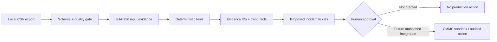

# Architecture and evidence contract

## Trust boundaries

- CSV content remains local in the Python CLI and static browser demo.
- Statistical tools are deterministic and do not require an LLM or remote API.
- An optional future model may plan or explain, but it must cite evidence IDs and cannot bypass the approval gate.
- Production connectors are deliberately absent from this submission. `production_actions_executed` is always `false`.

## Versioned output contract

- `methodology_version` and `policy.version` identify the calculation contract.
- `input_evidence.sha256` binds a report to exact input bytes.
- `evidence[].evidence_id` provides stable citations inside the report.
- `incidents[].incident_id` is deterministically derived from input digest, machine and period.
- `workflow` records completed and blocked stages.
- `limitations` prevents statistical signals from being represented as root-cause facts.

## Deployment choices

- CLI: Python 3.10+ standard library.
- Local service: loopback-only HTTP server with root confinement and request-size checks.
- Demo: self-contained `web/index.html`, deployable on any static host.
